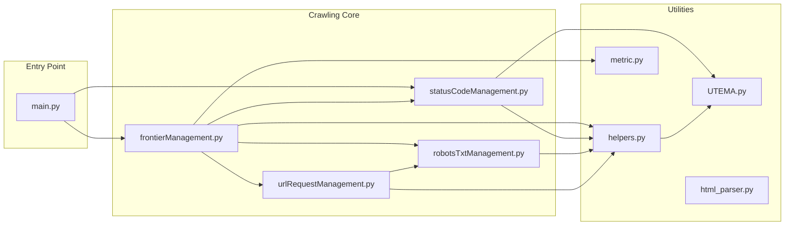

# crawler
**Version:** 1.0.0  

---

## External Dependencies

Install the following third‑party packages before running the crawler:

- **beautifulsoup4**  (for `from bs4 import BeautifulSoup, Comment, MarkupResemblesLocatorWarning`)  
- **duckdb**          (for `import duckdb`)  
- **heapdict**        (for `import heapdict` / `from heapdict import heapdict`)  
- **httpx**           (for `import httpx`)  
- **langdetect**      (for `from langdetect import detect`)  
- **matplotlib**      (for `import matplotlib.pyplot as plt`)  
- **numpy**           (for `import numpy`)  
- **pandas**          (for `import pandas`)  
- **python-dateutil** (for `from dateutil.parser import parse`)  
- **requests**        (for `import requests` and `from requests.adapters import HTTPAdapter`)  

You can install them all in one go:

```bash
pip install beautifulsoup4 duckdb heapdict httpx langdetect matplotlib numpy pandas python-dateutil requests
```

---

## What does "crawler" do?

crawler is sophisticated web- crawler that includes http- status- code handeling for single urls and even for whole domains.
Futher it is written in a way such that mutltiple http- requests are made at the same time, all to different domains.

---

## Features

- http- status- code handling for single urls  (see statusCodeManagement.py)
- http- status- code handling for whole domains using Unbiased Time-Exponential Moving Average (UTEMA.py and codeHandler.statusCodeManagement)
- usage of a sophisticated metric, we call the tueEngScore, which detects if a given url is in english and about Tübingen (metric.py)
- loop (for example CAPTCHA)- detection and handling (see specifically handle3xxLoop in statusCodeManagement.py for that)
- mutltiple http- requests are made at the same time, all to different domains (see urlRequestManagement.py)
- pre- processing of the url- content in order for index- usage (see html_parser.py)
- can be stopped safely without loosing any data (main.inputReaction)

---

## Basic description of functionality
At first crawler is started  (main.runCrawler) with a list as an argument. This list is used to initalise the frontier of the crawler. 
Directly after starting the crawler loads information it needs to process the frontier from storage (databaseManagement.load). Then as soon as all this information is placed into cache- dictionaries, in case the tueEngScore (main.frontierRead, metric.metric) is high enough,
the crawler writes the list it was given into the frontier (froniterManagement.frontierInit). While it works it does the following: It reads up to a given number of urls, all
of different domains, from the frontier (frontierManagement.manageFrontierRead), then processes(frontierManagement.frontierRead) them, and stores the relevant infomation into the caches. If further writes the new urls found during processing into the frontier (frontierManagement.frontierWrite). This is repeated until either the frontier is empty,
or the stop- signal is triggered in the terminal. As soon as one of those is happening, the program goes into storing mode, where the caches are all stored into storage (databaseManagement.store). As soon as this is done the program is ended.

---

## The structure of the crawler

---

### Some more details
Note that since the comment is quite detailed, we won't go into every detail here. Just a quick overview over what the files are for shoud be more than enough to get started:
 - main.py: Management of the overall crawler
 - frontierManagement.py: Manages the frontier and the other caches, while new urls are being crawled
 - databaseManagement.py: Manages loading (from stoarage to caches) and storing (from caches to storage) processes
 - statusCodeManagement.py: deals with http- responses which indicate that our requests (dond in urlRequestManagement.py) were
   not successfull. Here we also deal with the question when we consider not crawling an url or even a whole domain anymore. Further
   redirection loops are detected here (as is the case in CAPTCHAS for examples) and dealt with
-  robotsTxtManagement.py: This file simply deals with deciding bases on the robots.txt (none- existence of this file is also treated)
   if and at which minimum crawl- delay we are allowed to crawl a given url
- urlRequestManagement.py: This is all about fetching a list of given urls with different domains asynchronically.
- helpers.py: These are just helper- functions which are used in the other files
- seed.py: This contains our list of seed- urls with which we initalise the frontier
- metric.py: Different metrics (we did not make use of all) for calculating the tueEngScore
- tuebingen_terms.py: used by metric. py, contains terms which bear relevance with regard to Tübingen
- html_parser.py: extracts title, text and relevant (clickable) urls from the content of a given url

---

### Some more details regarding the http- status-code handling:
Essentially our whole http- status- code- handling here serves one purpose, and one purpose only: To prevent our crawler from
being blocked on urls or even whole domains if possible, and if blocking was detected to stop trying to crawl those urls/ domains.

- loop- detections: If there is a loop of redirects happening, meaning a list of urls links to respectively the next url in the 
  list in the redirect- field of the http- response, and all of them have 3.xx codes, and the list is none- ending (in our case
  we say that if the list has five elements, we consider it as non- ending), we are caught up in some kind of redirection loop, 
  where our crawl would be stuck, if we not at some point break out of it, so we break out after there have been 5 successive redirects, meaning we consider all the urls listed as uncrawlable and disallow them for our crawler. Since redirections also can just occur naturally on webistes without any warnings/ blockings from the server of the website for our crawler, but simply because the url
  moved we don't change anything in our crawling - approach with regard to that url, until we detect a loop.
  (see statusCodeManagement.codeHanderl and statusCodeManagement.3xxLoopHandler for more information)


- http- status- code counting: If for a single URL we receive a http- response with a status- code not of form 2.xx we start counting the 
  further occurences of this status-code. Once it occurs a status- code- specific (some status- codes are more serious then others) number
  of times we consider this url to be disallowed and start no further crawling- attempts for it. Depending on the code each time we receive a certain code, we further change the crawl- delay proactively. 


- http- status- code - time- series watching: Here we use Unbiased Time-Exponential Moving Average (see: On Moving Averages, Histograms and Time-Dependent Rates for Online Measurement, Menth and Hauser 2017, ICPE’17) to measure a weighted average over the time- series consisting of the status- codes and the time at which they where received for whole domains. If a certain threshold is reached here for a domain, we consider the whole domain as disallowed for our crawler.
  
---

## Getting Started
As already explained above, the management of the overall crawler is implemented in the main. In order to start the crawler, just use runCrawler there with a certain seedList. Note that this is already implemented right now: runCrawler(seed) is called, which runs the crawler with the seed list from seed.py


Just run this in the terminal when inside the crawler- folder, after doing all the package- installations:

   ```bash
  python main.py